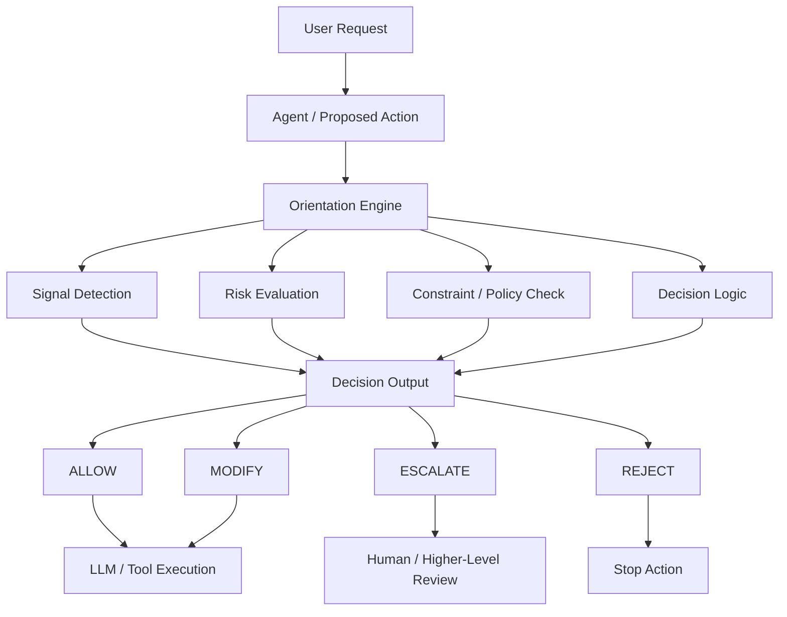
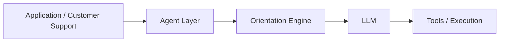
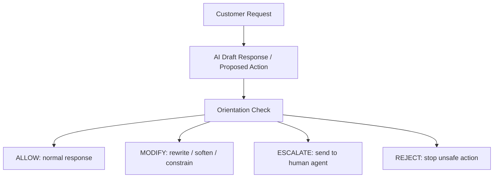

# 🛡️ Orientation Gate (v0.1)

> *"In an age of machines, our AI should reflect the warmth and complexity of the human soul — not just the efficiency of a processor."*

---

## The Problem

Most AI safety tools are **reactive filters** — they catch what the model *says* after the direction is already set.

But the real risk is locked in earlier: at the **objective level**, before optimization even begins.

This is the gap between Alignment and Orientation:

| | Question | When |
|---|---|---|
| **Alignment** | Is the system doing what we asked? | Post-objective |
| **Orientation** ↑ | Should the system be asked to do this at all? | Pre-objective |

Without an orientation layer, AI systems become high-precision amplifiers — they refract and magnify whatever is given to them, including what they shouldn't.

---

## What Is the Orientation Gate?

The Orientation Gate is a **proactive, pre-execution decision layer** for AI agents. It intercepts goal definitions *before* any optimization, reward loop, or deployment step begins — validating them against non-optimizable human-centered value constraints.

```bash
node orientation_gate/gate_node.js examples/demo_input.json
```

**Example Output:**
```json
{
  "decision": "ESCALATE",
  "risk_score": 0.74,
  "triggered_constraints": ["autonomy_violation", "power_asymmetry"],
  "reason": "Goal conflicts with protected value: user autonomy",
  "recommended_action": "Route to human-in-the-loop review"
}
```

Returns one of three structured decisions:
- ✅ `PROCEED` — direction is valid, optimization may begin
- ⚠️ `ESCALATE` — conflict detected, human review required
- ❌ `REJECT` — goal violates non-negotiable value constraints

---

## Core Design Principles

- **Pre-Alignment Gating** — Decides *if* to run, not just *how* to run
- **Non-Optimizable Constraints** — Values that cannot be traded off for performance
- **Objective Legitimacy** — Validates goals against human-centered ethical boundaries
- **Escalation Logic** — Built-in triggers for Human-in-the-Loop (HITL) review
- **Structural Risk Scoring** — Quantified, auditable decision output

---

## How It Works

**Inputs**
- Goal definition (human-provided)
- Value constraints (non-optimizable)
- Context boundaries (affected parties, scale, power asymmetry)

**Process**
1. Validate goal against value constraints
2. Detect structural conflict between optimization target and protected values
3. If conflict detected → halt optimization loop
4. Escalate decision to human review

**Minimal Control Loop (Conceptual)**
```python
while system_is_running:
    decision = orientation_gate(goal, context)

    if decision != "PROCEED":
        halt()
        escalate_to_human()
```
## System Diagram



---

## Where Orientation Sits



Orientation sits **between agent intent and model execution**.

---

## Customer Support Example



Orientation helps prevent:
- unauthorized commitments
- wrong policy interpretation
- missed escalation cases
- unstable AI actions

---

**Orientation** is a pre-execution decision layer for AI systems.
It evaluates proposed actions before execution and determines whether the system should **allow, modify, escalate, or reject** them.
---

## Example Use Case

See `/examples/customer_support_refund_case.md` for a real-world customer support scenario demonstrating how the gate evaluates a retention optimization goal against user autonomy constraints.

---

## 🤝 Call for Founding Contributors

The Orientation Gate is in its infancy. I am looking for **10 Founding Contributors** to help evolve this from a v0.1 draft into a robust industry specification for agentic AI safety.

**How you can help:**

- **Red-Team It** — Fork the repo and try to bypass the gate with complex gray-area goals. Where does the logic fail?
- **Add Industry Constraints** — Submit a PR with `value_constraints` for specific sectors (Healthcare, Finance, Legal, etc.)
- **Improve Risk Scoring** — Help refine the algorithm for abstract human values like dignity, autonomy, and resonance
- **Open an Issue** — Share data, edge cases, or design critiques

> All Founding Contributors will be credited in the official v1.0 release documentation.

---

## 🗺️ Roadmap & Open Challenges

- [ ] **Latency** — Optimizing orientation checks for real-time agentic workflows (<100ms)
- [ ] **Subjective Quantification** — Refining risk scores for abstract values (dignity, resonance, autonomy)
- [ ] **The Escalate Loop** — Designing the Human-in-the-Loop UI/UX when ESCALATE triggers
- [ ] **Audit Logs** — Cryptographically signed proofs of each orientation decision
- [ ] **Prism Integration** — Incorporating emotional resonance as a measurable structural signal (EmotionCode™)

---

## Project Structure

```
orientation-gate/
├── orientation_gate/
│   ├── gate_node.js       # Core decision engine
│   └── schema.json        # Value constraints schema
├── modules/
│   └── refund_retention_v0_2.json   # Example domain module
├── examples/
│   ├── demo_input.json
│   └── customer_support_refund_case.md
├── docs/
│   ├── spec_v0_1.md
│   └── rationale.md
└── README.md
```

---

## Status

`Draft v0.1` — Seeking feedback from AI agent developers, safety researchers, and governance practitioners.

---

## License

MIT License

---

## Contact

Built by **Serena Wang** at [SenuxTech](https://www.senuxtech.com)  
Exploring the intersection of emotional intelligence, language systems, and AI safety design.

*Building the emotional intelligence layer for human–AI resonance.*
